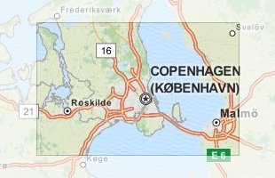
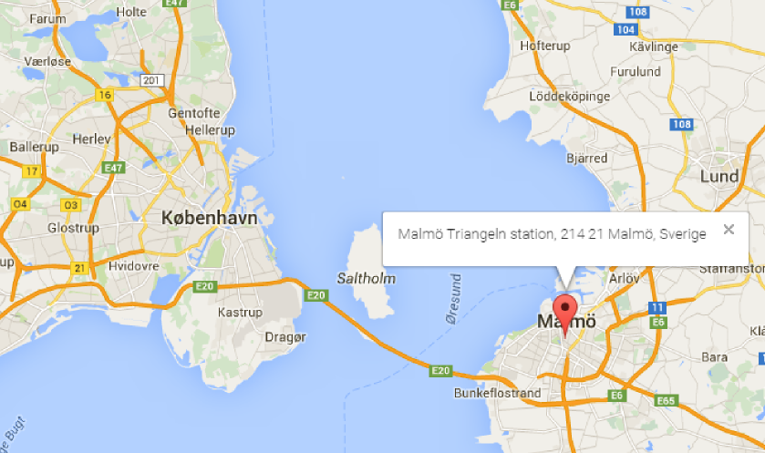
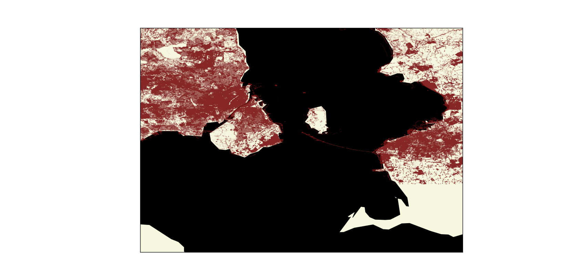

<div style="max-width:800px; margin:auto">
<center>
<h1>Wrangling OpenStreetMap Data with MongoDB</h1>
<h5><i>Rógvi Dávid Arge</i></h5>


<br/>

http://metro.teczno.com/#copenhagen
</center>

---

## 1. Choice of Map
For this project I really wanted to do some data wrangling on a place I was very familiar with. Since I'm from Tórshavn in Faroe Islands I first searched OpenStreetMap for data from Faroe Islands. However, I wasn't successful in finding a big enough dataset. I then turned to Copenhagen, a city in which I've spent half my life, and which I love! Luckily I found a dataset and downloaded it (interested readers can download the same dataset from the link at the top).

---


## 2. Problems Encountered in the Map
After downloading the data set, I played around with it for a while. I decided to try and get the data into MongoDB which went relatively smoothly. To get the data into a json format, which can be imported from the MongoDB command line, I used a slightly modified version of the last program written for Lesson 6 of the Data Wrangling with MongoDB course. Getting the data into MongoDB and writing a small script for python really allowed me to get a much better grip on MongoDB, Pymongo, but also the problems of the dataset, which I'll go through one by one.

#### Malmö and Other Swedish Data
From a discussion I had with a coworker, I wanted to see if I could get a list of all the toilets in Copenhagen, and ran this aggregation:
```javascript
> db.cities.aggregate([{'$match': {'amenity': {'$exists': 1}}}, {'$group': {'_id': '$amenity', 'count': {'$sum': 1}}}, {'$sort': {'count': -1}}])
```
When going through the results I found this 
```javascript
...
{ "_id" : "bicycle_pump", "count" : 1 }
{ "_id" : "mortuary", "count" : 1 }
{ "_id" : "vehicle_ramp", "count" : 1 }
...
```
I was interested in the bicycle pump because I found it strange that there was only one bicycle pump in this dataset, so I ran the following aggregation command to find the bicycle pump's position:
```javascript
> db.cities.aggregate([{'$match': {'amenity': 'bicycle_pump'}}])
```
which returned the following results:
```javascript
{ "_id" : ObjectId("5668892f0405f363dbb4146d"), "pos" : [ 55.5922202, 13.0019409 ], "amenity" : "bicycle_pump", "type" : "node", "id" : "2409034810", "created" : { "changeset" : "17243520", "user" : "lbschenkel", "version" : "1", "uid" : "139044", "timestamp" : "2013-08-06T16:31:43Z" } }
```
However, pluggin this latitude and longitude into http://www.latlong.net/Show-Latitude-Longitude.html
returned the following map and position:

</br>

<center>



</center>

</br>

which is obviously in Malmö and not Copenhagen!
To find out if this was a single case or if there was more data in my Copenhagen dataset that was actually located in Malmö I ran another aggregation to find all longitudes greater than 12.84:
```javascript
> db.cities.find({'pos.1': {'$gte': 12.84}}).count()
```
which returned a whopping 766528!
Comparing this with the total number of documents in the collection:
```javascript
> db.cities.find().count()
3828468
```
Which means that approximately 20% of the entire Copenhagen dataset isn't even in Copenhagen!

Finding this meant that I could remove this data from the database, leaving me with 3061940 documents. But just as I thought all swedish data had been removed I stumbled upon another swedish document. This one was found when I tried to list the different representations of city in an ascending order using the following aggregation:
```javascript
> db.cities.aggregate([{'$match': {'address.city': {'$exists': 1}}}, {'$group': {'_id': '$address.city', 'count': {'$sum': 1}}}, {'$sort': {'count': 1}}, {'$limit': 5}])
```
The results were:
```javascript
{ "_id" : "Härslöv", "count" : 1 }
{ "_id" : "löddeköpinge", "count" : 1 }
{ "_id" : "Ørestads Boulevard", "count" : 1 }
{ "_id" : "Vallensbaek", "count" : 1 }
{ "_id" : "Svogerslev", "count" : 1 }
```
where the first two results are actually in Sweden!
Running a check for the number of documents with the position argument might explain why some points couldn't be removed based on their positions - because they didn't have any.
```javascript
> db.cities.find({'pos': {'$exists': 0}}).count()
456104
```
Meaning there are still issues regarding swedish data in the Copenhagen dataset.


#### Danish Representation of Addresses
Another issue I found had to do with the representation of city names. In the data I found that some addresses didn't list city as Copenhagen, but as Copenhagen V or Copenhagen N. In Copenhagen these letters after the city name are used to designate postal codes. However, some of these documents did contain another type of address representation called osak and interested readers can read more about it here: http://wiki.openstreetmap.org/wiki/Da:Addresses. What this means for the representation of addresses and streets is that they can be inconsistent. As an example, by running this find command on the collection:
```javascript
> db.cities.find({'osak:municipality_name': {'$exists': 1}})
```
These are some of the results:
```javascript
{ "_id" : ObjectId("566888e30405f363db9161fe"), "osak:municipality_no" : "101", "created" : { "changeset" : "28352913", "user" : "AWSbot", "version" : "6", "uid" : "2184056", "timestamp" : "2015-01-23T16:15:13Z" }, "osak:identifier" : "0A3F507A367932B8E0440003BA298018", "osak:street_no" : "0004", "pos" : [ 55.671612, 12.5594 ], "osak:street_name" : "Abel Cathrines Gade", "source" : "AWS Web API", "osak:revision" : "2002-04-07T12:00:00", "address" : { "city" : "København V", "street" : "Abel Cathrines Gade", "housenumber" : "21A", "postcode" : "1654", "country" : "DK" }, "osak:municipality_name" : "København", "osak:house_no" : "21A", "type" : "node", "id" : "340483101" }
{ "_id" : ObjectId("566888e30405f363db9161ff"), "osak:municipality_no" : "101", "created" : { "changeset" : "28352913", "user" : "AWSbot", "version" : "6", "uid" : "2184056", "timestamp" : "2015-01-23T16:15:16Z" }, "osak:identifier" : "0A3F507A367A32B8E0440003BA298018", "osak:street_no" : "0004", "pos" : [ 55.671717, 12.559483 ], "osak:street_name" : "Abel Cathrines Gade", "source" : "AWS Web API", "osak:revision" : "2002-04-07T12:00:00", "address" : { "city" : "København V", "street" : "Abel Cathrines Gade", "housenumber" : "21B", "postcode" : "1654", "country" : "DK" }, "osak:municipality_name" : "København", "osak:house_no" : "21B", "type" : "node", "id" : "340483104" }
```
and as you can see the data has both city name and municipality name, however the municipality name is actually the correct name for the city and the municipality.


## 3. Data Overview:
Here are some statistics describing the raw- and cleaned file, some statistics on the dataset, and the MongoDB commands used:

### File Info

|           Filename          |     File size     |
| :-------------------------- | ----------------: |
| copenhagen_denmark.osm      |       906 MB      |
| copenhagen_denmark.osm.json |      1.22 GB      |

### Number of Documents
```javascript
> db.cities.find().count()
3061940
```

### Number of Unique Users
```javascript
> db.cities.distinct("created.user").length
1721
```

### Number of Nodes and Ways
```javascript
> db.cities.find({"type":"node"}).count()
2605830
> db.cities.find({"type":"way"}).count()
456073
```

### Number of amenities
```javascript
> db.cities.distinct("amenity").length
132
```

### Number of compressed_air (pumps)
```javascript
> db.cities.find({"amenity":"compressed_air"}).count()
14
```

### Number of benches
```javascript
> db.cities.find({"amenity":"bench"}).count()
888
```

## 4. Other Ideas:
Being a big fan of Copenhagen as a biking city, and being inspired by people to be more aware of green energy I really wanted to use the data to find location of bicycle pumps, charging stations, recycling and waste bins. Luckily, the data contains some data for this type of information:
```javascript
> db.cities.aggregate([{"$match": {"amenity":{"$exists":1}}},{"$group":{"_id":"$amenity", "count":{"$sum": 1}}},{"$sort":{"count":-1}}])
{ "_id" : "bicycle_parking", "count" : 1671 }
...
{ "_id" : "recycling", "count" : 261 }
...
{ "_id" : "waste_basket", "count" : 225 }
...
{ "_id" : "charging_station", "count" : 121 }
...
{ "_id" : "bus_station", "count" : 65 }
...
{ "_id" : "bicycle_rental", "count" : 20 }
...
{ "_id" : "waste_disposal", "count" : 15 }
{ "_id" : "compressed_air", "count" : 14 }
...
{ "_id" : "bicycle_repair_station", "count" : 3 }
```

For the charging_stations, I was interested in seing who the operators were. Finding the total number of operators first with the following command:
```javascript
> db.cities.aggregate([{"$match": {"amenity": {"$exists": 1}}}, {"$match": {"amenity": "charging_station"}}, {"$project": {"user": "$created.user", "op": "$operator"}}, {"$group": {"_id": "$op", "count":{"$sum": 1}}}, {"$sort": {"count":-1}}, {"$group": {"_id": "total", "Total": {"$sum": "$count"}}}])
{ "_id" : "total", "Total" : 121 }
```
I could now get the percentage of charging stations by operator:

```javascript
> db.cities.aggregate([{"$match": {"amenity": {"$exists": 1}}}, {"$match": {"amenity": "charging_station"}}, {"$project": {"user": "$created.user", "op": "$operator"}}, {"$group": {"_id": "$op", "count":{"$sum": 1}}}, {"$sort": {"count":-1}}, {"$project":{"_id": "$_id", "ratio": {"$divide":["$count", 1.21]}}}])
{ "_id" : "E-On", "ratio" : 80.99173553719008 }
{ "_id" : "Københavns Kommune", "ratio" : 4.132231404958678 }
{ "_id" : "CLEVER", "ratio" : 4.132231404958678 }
{ "_id" : "MoveAbout", "ratio" : 3.3057851239669422 }
{ "_id" : "E.ON", "ratio" : 2.479338842975207 }
{ "_id" : "Clever", "ratio" : 0.8264462809917356 }
{ "_id" : "Tesla Motors", "ratio" : 0.8264462809917356 }
{ "_id" : "Delebilfonden", "ratio" : 0.8264462809917356 }
{ "_id" : "Lets Go/Delebilfonden", "ratio" : 0.8264462809917356 }
{ "_id" : "Better Place Danmark", "ratio" : 0.8264462809917356 }
{ "_id" : null, "ratio" : 0.8264462809917356 }
```

As it turned out, E-ON, the was by far the operator of most charging stations in Copenhagen, with 98 charging stations. To check if this number was correct I looked at https://chargemap.com/networks/eon, and according to this site, E-ON actually has 115 charging stations in Copenhagen, meaning we are missing 17.

#### Top User Contributers
```javascript
> db.cities.aggregate([{"$group": {"_id": "$created.user", "count":{"$sum":1}}}, {"$project": {"_id": "$_id", "stat": {"$divide": ["$count", 30619.40]}}},{"$sort": {"stat": -1}}, {"$limit": 600}, {"$group": {"_id": "_", "total": {"$sum": "$stat"}}}])

{ "_id" : "AWSbot", "stat" : 13.07007975335898 }
{ "_id" : "Hjart", "stat" : 9.028622376663161 }
{ "_id" : "AE35", "stat" : 8.62760210846718 }
{ "_id" : "frederikssund_import", "stat" : 8.568064691012887 }
{ "_id" : "Municipality Import Ballerup", "stat" : 5.585968372992285 }
{ "_id" : "b-holdet", "stat" : 4.377159578567836 }
{ "_id" : "hotelsierra", "stat" : 3.824340124234962 }
{ "_id" : "Leif Lodahl", "stat" : 2.7570429205013816 }
{ "_id" : "Niels Beck", "stat" : 2.7560304904733597 }
{ "_id" : "Grillo", "stat" : 2.613996355251899 }
{ "_id" : "findvej", "stat" : 2.559096520506607 }
{ "_id" : "Johnny Carlsen", "stat" : 2.4731379452242694 }
{ "_id" : "Niels Elgaard Larsen", "stat" : 2.2479865706055637 }
{ "_id" : "and13", "stat" : 1.9844608320215287 }
{ "_id" : "joakimfors", "stat" : 1.8063711241892395 }
```

#### Top 10 amenities:
```javascript
> db.cities.aggregate([{"$match": {"amenity":{"$exists":1}}},{"$group":{"_id":"$amenity", "count":{"$sum": 1}}},{"$sort":{"count":-1}},{"$limit": 10}])
{ "_id" : "parking", "count" : 7719 }
{ "_id" : "bicycle_parking", "count" : 1671 }
{ "_id" : "fast_food", "count" : 1023 }
{ "_id" : "bench", "count" : 888 }
{ "_id" : "restaurant", "count" : 733 }
{ "_id" : "school", "count" : 660 }
{ "_id" : "post_box", "count" : 480 }
{ "_id" : "cafe", "count" : 470 }
{ "_id" : "place_of_worship", "count" : 400 }
{ "_id" : "fuel", "count" : 358 }
```

#### Data Streamlining
According to http://danmarksadresser.dk/standarder-adressedata, which handles danish address information, there isn't really any standard for describing danish addresses:

*Standarder for adresser
Der findes desværre ingen opdaterede, formelle standarder for Danmarks adresser. Nogle af de vigtigste elementer, som indgår i en adresse, er dog i 2004-2008 standardiseret i det såkaldte OIO-arbejde.*

Roughly translated as:

*Standards for addresses
Sadly, there is no updated, formal standard for Danish addresses. Some of the important elements, which are a part of an address, were standardized in 2004-2008 in the so-called OIO-work.*

The danish OSAK standards (or the lack thereof) for representing documents therefore creates more confusion than necessary. One of the first steps for streamlining the Copenhagen dataset would therefore be to set up a standard for representing addresses, and preferably one similar to the standards of other countries. One important change I feel needs to done is to distinguish cities from postcode districts, so that city names like "København Ø" don't occur. Furthermore, nodes without positions, should promply be removed. This would be done to filter out all the non-position nodes located in Sweden. According to information on http://wiki.openstreetmap.org/wiki/OSAK, this OSAK standard is being phased out in favor of a BBR standard, though the implications of this BBR standard, aren't known. 

#### Difficulties
Implementing a standard for representing danish addresses, may be quite difficult, but maybe there is an easy solution. First of all, even though OSAK seems to be the semi official standard for representing Danish addresses here are some numbers which should illustrate why there might be difficulties in implementing a standard:

* Only **14.82%** contain the tag osak:street_no
* Only **2.63%** contain the tag osak:street
* Only **14.91%** contain the tag osak:municipality_no
* Only **9.46%** contain the tag osak:street_name
* Only **8.69%** contain the tag osak:municipality_name

So, as is clear from these numbers, implementing a standard would not only be difficult because of the existance of the OSAK standard (and the threatening coming of the BBR standard), but also because the implementation of the OSAK standard is sloppy at best. However, as can be seen below, of the users using the OSAK standard **99.93%** of the implementation is done by the top 5 contributers and **99.82%** is done implemented by the top 2 users! 

* Total occurences of osak:municipality_no: 456576
* Top contributers: 
    - AWSbot: 400141
    - findvej: 55592
    - Bilbo-denmark: 402
    - Niels Elgaard Larsen: 83
    - Hjart: 59

Of these top two users, AWSbot is probably a bot, which is responsible for 87.64% of the contributions. If we were somehow able to modify how the bot does its contributions, we might be able to easily find a way to streamline the data.

## Conclusion
After working on the data for a couple of days, it is clear to me that the Copenhagen dataset has a lot of issues. I cleaned away many of obvious issues like data from Sweden but there is still much work to be done if one wishes this dataset to be consistent and without any trace of swedish data. I would really like to work more on it, and in the future I hope to use MongoDB along with the data wrangling tools I've picked up over the course of this project to try out some App development.

<center>

<br/>
    Red areas are data points
</center>
```python

```
</div>
